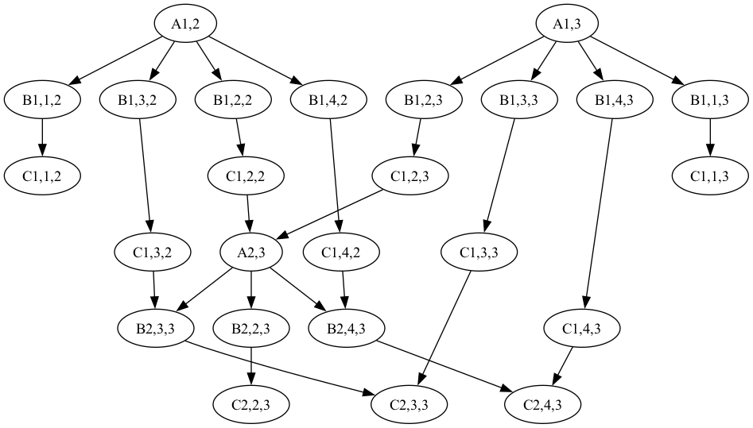

# Gaussian elimination
Home assignment 3

##### `main.py`
```py
import os
import sys
from alphabet import MatrixAlphabet
from file_reader import FileReader
from relation import DependencyRelation, IndependencyRelation
from normal_form import FoataNF
from drawer import GraphDrawer


if __name__ == "__main__":
  PATH           = os.path.dirname(__file__)
  PATH_DATA      = os.path.join(PATH, "../data")
  PATH_OUTPUT    = os.path.join(PATH, "../output")
  TEST_FILENAMES = [ "test1", "test2" ]

  test_filename = "test1"
  if len(sys.argv) > 1:
    test_filename = sys.argv[1]

  print(test_filename)

  # Read input file, first line is number of variables (height of matrix).
  # The rest are columns of matrix, the last one column is column of values.
  N, matrix = FileReader.read(os.path.join(PATH_DATA, f"{test_filename}.txt"))
  print(matrix)

  alphabet = MatrixAlphabet(N)
  alphabet.build()
  print(alphabet)

  # Create and print dependency relation (D).
  dependency_relation = DependencyRelation(alphabet)
  dependency_relation.build()
  print(dependency_relation)

  # Visualize results.
  drawer = GraphDrawer(dependency_relation.result, alphabet)
  drawer.draw(os.path.join(PATH_OUTPUT, f"{test_filename}.gv"))
  drawer.draw(os.path.join(PATH_OUTPUT, f"{test_filename}_loop.gv"), self_loop=True)

  # Create and print independency relation (I).
  independency_relation = IndependencyRelation(alphabet, dependency_relation)
  independency_relation.build()
  print(independency_relation)

  # Create and print Foata normal form based on the input word.
  all_symbols = [i for i in range(len(alphabet.symbols))]
  foata_normal_form = FoataNF(all_symbols, dependency_relation, independency_relation)
  foata_normal_form.build()
  print(f"FNF: {foata_normal_form}")

```

##### `relation.py`
```py
from abc import ABC, abstractmethod
import re
import networkx as nx

from alphabet import MatrixAlphabet


class AbstractRelation(ABC):
  set_symbol = "AR"

  def __init__(self, alphabet: MatrixAlphabet) -> None:
    self.alphabet = alphabet
    self.result: list[list[int]] | None = None

  def __bool__(self) -> bool:
    return self.result != None

  def __str__(self) -> str:
    relation_set = f"{self.set_symbol} = {{%s}}"

    if not self.result or len(self.result) == 0:
      return relation_set % " "

    formatted_results: list[str] = []
    for i in range(len(self.alphabet.symbols)):
      for j in self.result[i]:
        i_str, j_str = self.__create_tuple_of_expressions(i, j)
        formatted_results.append(f"({i_str}, {j_str})")

    return relation_set % f" {', '.join(formatted_results)} "

  def __create_tuple_of_expressions(self, i: int, j: int) -> tuple[str, str]:
    return self.alphabet.symbols[i], self.alphabet.symbols[j]

  @abstractmethod
  def build(self) -> None:
    pass


class DependencyRelation(AbstractRelation):
  set_symbol = "D"

  # Override
  def build(self) -> None:
    N = self.alphabet.N
    self.result = [[] for _ in self.alphabet.symbols]

    for idx, symbol in enumerate(self.alphabet.symbols):
      symbol_type = symbol[0]
      i = j = k = 0

      match = list(map(
        lambda index: int(index), re.findall(r"[0-9]+", symbol)))

      if symbol_type == 'A' and len(match) == 2:
        i, k = match
      elif (symbol_type == 'B' or symbol_type == 'C') and len(match) == 3:
        i, j, k = match
      else:
        print(f"[Warning] Symbol \"{symbol}\" has been omitted.")
        continue

      self.result[idx].append(idx)

      if symbol_type == 'A':
        if i > 1:
          self.result[self.alphabet.get_index_by_symbol(f"C_({i - 1},{i},{i})")]    .append(idx)
          self.result[self.alphabet.get_index_by_symbol(f"C_({i - 1},{i},{i + 1})")].append(idx)
        for j in range(i, N + 2):
          self.result[idx].append(self.alphabet.get_index_by_symbol(f"B_({i},{j},{k})"))
      elif symbol_type == 'B':
        self.result[idx].append(self.alphabet.get_index_by_symbol(f"C_({i},{j},{k})"))
      elif symbol_type == 'C':
        if j > i + 1 and i + 1 < N:
          if k + 1 <= N:
            self.result[idx].append(self.alphabet.get_index_by_symbol(f"B_({i + 1},{j},{k + 1})"))
          if i + 1 < k:
            self.result[idx].append(self.alphabet.get_index_by_symbol(f"C_({i + 1},{j},{k})"))


class IndependencyRelation(AbstractRelation):
  set_symbol = "I"

  def __init__(self, alphabet: MatrixAlphabet, dependency_relation: DependencyRelation) -> None:
    super().__init__(alphabet)
    self.dependency_relation = dependency_relation

  # Override
  def build(self) -> None:
    n = len(self.alphabet.symbols)
    self.result = [
      [i for i in range(n)]
      for _ in range(n)
    ]

    for i in range(n):
      for relation in self.dependency_relation.result[i]:
        try:
          self.result[i].remove(relation)
        except:
          pass
```


## Tests

### Test 1
#### Input
  ```
  3
  2.0 1.0 3.0
  4.0 3.0 8.0
  6.0 5.0 16.0
  6.0 15.0 27.0
  ```

#### Output
- Foata normal form (FNF): $(A_{1,2}A_{1,3})(B_{1,1,2}B_{1,2,2}B_{1,3,2}B_{1,4,2}B_{1,1,3}B_{1,2,3}B_{1,3,3}B_{1,4,3})(C_{1,1,2}C_{1,2,2}C_{1,3,2}C_{1,4,2}C_{1,1,3}C_{1,2,3}C_{1,3,3}C_{1,4,3})(A_{2,3})(B_{2,2,3}B_{2,3,3}B_{2,4,3})(C_{2,2,3}C_{2,3,3}C_{2,4,3})$
- Digraph of $DW$ with source code (DOT Language):
  
  ```
  digraph "Hesse diagram" {
    0 [label="A_(1,2)"]
    1 [label="B_(1,1,2)"]
    2 [label="B_(1,2,2)"]
    3 [label="B_(1,3,2)"]
    4 [label="B_(1,4,2)"]
    5 [label="C_(1,1,2)"]
    6 [label="C_(1,2,2)"]
    7 [label="C_(1,3,2)"]
    8 [label="C_(1,4,2)"]
    9 [label="A_(1,3)"]
    10 [label="B_(1,1,3)"]
    11 [label="B_(1,2,3)"]
    12 [label="B_(1,3,3)"]
    13 [label="B_(1,4,3)"]
    14 [label="C_(1,1,3)"]
    15 [label="C_(1,2,3)"]
    16 [label="C_(1,3,3)"]
    17 [label="C_(1,4,3)"]
    18 [label="A_(2,3)"]
    19 [label="B_(2,2,3)"]
    20 [label="B_(2,3,3)"]
    21 [label="B_(2,4,3)"]
    22 [label="C_(2,2,3)"]
    23 [label="C_(2,3,3)"]
    24 [label="C_(2,4,3)"]
    0 -> 0
    0 -> 1
    0 -> 2
    0 -> 3
    0 -> 4
    1 -> 1
    1 -> 5
    2 -> 2
    2 -> 6
    3 -> 3
    3 -> 7
    4 -> 4
    4 -> 8
    5 -> 5
    6 -> 6
    6 -> 18
    7 -> 7
    7 -> 20
    8 -> 8
    8 -> 21
    9 -> 9
    9 -> 10
    9 -> 11
    9 -> 12
    9 -> 13
    10 -> 10
    10 -> 14
    11 -> 11
    11 -> 15
    12 -> 12
    12 -> 16
    13 -> 13
    13 -> 17
    14 -> 14
    15 -> 15
    15 -> 18
    16 -> 16
    16 -> 23
    17 -> 17
    17 -> 24
    18 -> 18
    18 -> 19
    18 -> 20
    18 -> 21
    19 -> 19
    19 -> 22
    20 -> 20
    20 -> 23
    21 -> 21
    21 -> 24
    22 -> 22
    23 -> 23
    24 -> 24
  }
  ```
